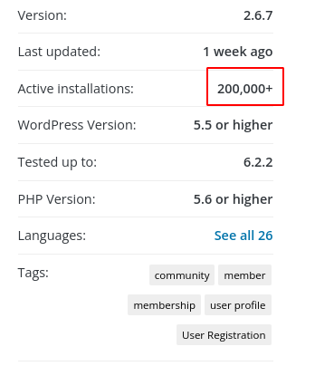
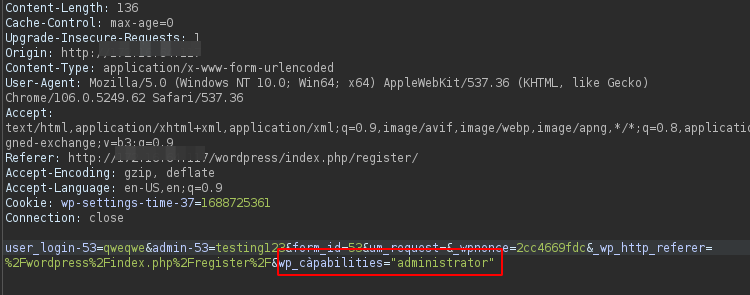
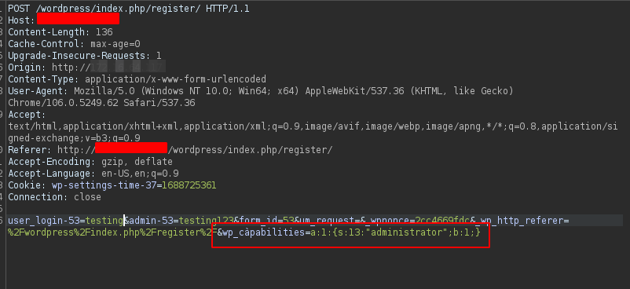
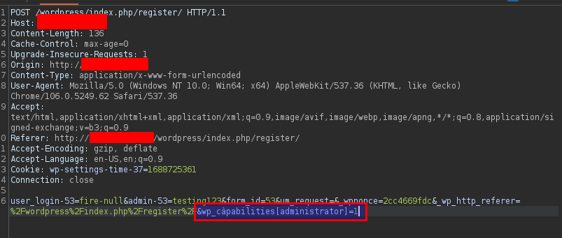

# CVE-2023-28424 - Unauthorized admin access for Ultimate Member plugin POC
# CVSS score: 9.1
# Date: 07/04/2023

 
## What is ultimate member plugin?
### Ultimate member plugin is a popular membership plugin for registering user's, the plugin has 200,000+ active installation.

## Quick Check
#### A critical vulnerability was discovered in Ultimate member plugin in 7th of july , the attacker could create a admin account by using a privilege escalation technique that can lead to take over the wordpress website.

### So How Does the exploit work?
##### Well if we take a look at the Roles and Capabilities of wordpress it have quite a few roles that a user can have `Super Admin`, `Administrator`, `Editor`, `Author`, `Contributor`, `Contributor`, so how we can gain admin privilage ? well at fisrt lets see how does the ultimate member plugin works , first you need to configure the plugin in order to function well so we need to create a few pages in `Pages` section then we link those pages to Ultimate member > setting after that we can make new roles or just use the default roles ultimate member offers.

##### By now we should have a working plugin, now lets get our hands dirty and see how this works in backend. i did register a normal user with   `Subscriber` role and if we take a look at the `wp_usermeta` table in mysql we can see the `wp_capabilities` value is set to an serialize array and from there it defines our role wich in this case is `Subscriber`.

##### So how we can change the value of `wp_capabilities` ? well we can pass `wp_capabilities` as an parameter in the post request while we registering like so:

##### But it wont end there yet, you see theres a function named `is_metakey_banned` and the function works by cheking few values such as `"cap_key"`, `"wp_capabilities"`, `"wp_user_level"`, `"user_activation_key"` etc... what we intrestin is `wp_capabilities` but if we have it in our request boddy  it'll hit the `break` there to pervent us changeing our role.

##### From here on we can try using few diffrent decodin types but it wont work after a while research and a bit of help from AI i discoverd that wordpress except accent characters by default characters like `à, è, ì, ò, ù, À, È, Ì, Ò, Ù`, so now if we use this characters in our request body somthing like `wp_càpabilities=administrator` what will happen? well it doesnt hit the break point on line 182 in class-user.php and we can bypass the `is_metakey_banned` function.

##### Cheking the mysql we can see we can changed the value .

##### But we are not admin infact we don't have any roles at all .

##### We did somthing obviously but in order to become admin we need to have the excat same value of admin which is looks like this `a:1:{s:13:"administrator";b:1;}` ok now lets try it and pass this straight to our parameter.

##### Again checking the mysql we did set value of `wp_capabilities` but this isnt what we expected.

##### It got our value and turned into a serialized string  but what but looking at the `wp_capabilities` of admin we can see is an serialized array thats what we whant so wordpress has its own serialization so we can use that to pass our value as an array then wordpress does the rest for us so here is how our payload looks like `wp_càpabilities[administrator]=1`.

##### At the end we can see the value of `wp_capabilities` has been changed to `a:1:{s:13:"administrator";s:1:"1";}` which now can login as admin.

##### And now we can login as admin.

